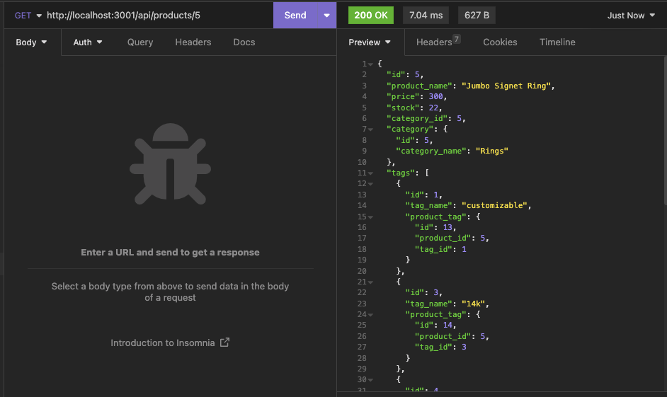

# orm-baubleBackend
## UCB Bootcamp Module 13 Homework Challenge
### Description
This is my submission for the UCB Bootcamp Module 13 Homework Challenge.  
This submission: 
* Utilizes Express.js API to use Sequilize to interact with a jewelry-themed MySQL inventory database
* Stores the database name and MySQL credentials within an environment variable file
* Connects to the database using Sequelize
* Uses schema and seed commands to create a database and seed with test data
* Uses the CLI to start the server and sync Sequelize models to the MySQL database
* Uses API GET routes to display category, product, and tag information in formatted JSON
* Uses API POST, PUT, and DELETE routes to create, update, and delete data in the database 

This app builds upon starter code provided by edX Boot Camps LLC.

### Installation

### Future Development
Connect to front-end to load & maintain inventory data onto ecommerce site.

### Screenshot of app

### Review
* Github repository: 
https://github.com/jmariemo/orm-baubleBackend

* Video walkthrough: 
https://drive.google.com/file/d/1m1rTNAcdPWrTir2KWcjw0HZkYVYFz-aB/view